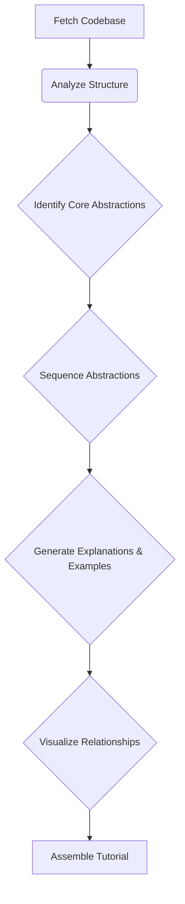

# Design Doc: AI Codebase Knowledge Builder

> Please DON'T remove notes for AI

## Requirements

> Notes for AI: Keep it simple and clear.
> If the requirements are abstract, write concrete user stories

As a developer new to a project,
I want to provide a GitHub repository URL,
So that I can receive an automatically generated tutorial that explains the core abstractions, their relationships (with a visualization), and how they work together, using beginner-friendly language and examples, allowing me to understand the project's structure and key concepts quickly without reading all the code manually.

**User Stories:**
1. **Input:** User provides a public GitHub repository URL.
2. **Processing:** The system fetches the codebase, analyzes it to identify key abstractions (e.g., main classes, modules, functions), determines their relationships, and sequences them logically for a tutorial.
3. **Output Generation:** The system generates explanations for each core abstraction, provides practical code examples, creates a visualization (e.g., Mermaid diagram) of the relationships, and assembles these components into a coherent tutorial document (e.g., markdown).
4. **Clarity:** The tutorial uses simple language, analogies where helpful, and detailed descriptions to ensure clarity for beginners.

## Flow Design

> Notes for AI:>
> 1. Consider the design patterns of agent, map-reduce, rag, and workflow. Apply them if they fit.>
> 2. Present a concise, high-level description of the workflow.

### Applicable Design Pattern:

- **Workflow:** The process involves a sequence of distinct steps: fetching data, analyzing it, generating content based on analysis, and assembling the final output. This fits the Workflow pattern well.
- **RAG (potentially):** Could be used within nodes to find relevant code snippets or documentation to augment explanations generated by the LLM.

### Flow high-level Design:

1. **Fetch Codebase**: Clones or downloads the codebase from the provided GitHub URL.
2. **Analyze Structure**: Parses the code to identify files, main modules, classes, functions, and potentially dependencies (statically or via LLM analysis).
3. **Identify Core Abstractions**: Uses an LLM to analyze the codebase structure and identify the most important concepts/abstractions a beginner should understand first.
4. **Sequence Abstractions**: Uses an LLM to determine a logical order to present these abstractions for learning purposes.
5. **Generate Explanations & Examples**: For each core abstraction, uses an LLM to generate a detailed, beginner-friendly explanation and find/generate relevant code examples.
6. **Visualize Relationships**: Generates a diagram (e.g., Mermaid) showing how the core abstractions relate to each other based on the analysis.
7. **Assemble Tutorial**: Combines the sequenced explanations, examples, and visualization into a final tutorial document.



## Utility Functions

> Notes for AI:>
> 1. Understand the utility function definition thoroughly by reviewing the doc.>
> 2. Include only the necessary utility functions, based on nodes in the flow.

1. **Fetch Code from GitHub** (`utils/fetch_github.py`)
   - *Input*: `github_url` (str)
   - *Output*: `local_code_path` (str) or `code_content` (dict/str)
   - *Necessity*: Needed by the `Workspace Codebase` node to get the source code.
2. **Analyze Code Structure** (`utils/code_analyzer.py`)
   - *Input*: `code_path` (str) or `code_content` (dict/str)
   - *Output*: `structure_analysis` (dict/json - e.g., file list, class/function definitions, dependencies)
   - *Necessity*: Needed by the `Analyze Structure` node. Could use tree-sitter, AST parsing, or an LLM.
3. **Call LLM** (`utils/call_llm.py`)
   - *Input*: `prompt` (str), potentially `context` (str)
   - *Output*: `response` (str)
   - *Necessity*: Used by multiple nodes (`Identify Core Abstractions`, `Sequence Abstractions`, `Generate Explanations & Examples`) for analysis and generation tasks.
4. **Generate Visualization** (`utils/generate_viz.py`)
   - *Input*: `abstractions` (list/dict), `relationships` (list/dict)
   - *Output*: `mermaid_code` (str)
   - *Necessity*: Needed by the `Visualize Relationships` node.

*(Optional Utility based on RAG approach)*
1. **Embedding** (`utils/get_embedding.py`)
   - *Input*: `text` (str)
   - *Output*: a vector of floats (e.g., 3072 floats)
   - *Necessity*: Potentially used by explanation generation node if RAG is used to find relevant code snippets.
2. **Vector Search** (`utils/vector_search.py`)
   - *Input*: `query_embedding` (vector), `code_embeddings_db`
   - *Output*: `relevant_code_snippets` (list)
   - *Necessity*: Potentially used by explanation generation node if RAG is used.

## Node Design

### Shared Memory

> Notes for AI: Try to minimize data redundancy

The shared memory structure is organized as follows:

Python

```
shared = {
    "github_url": "input_url",
    "code_content": {}, # or path to local clone
    "code_analysis": { # Output from Analyze Structure
        "files": [],
        "abstractions_raw": [], # e.g., list of classes, functions
        "dependencies": {}
    },
    "core_abstractions": [ # Output from Identify Core Abstractions
        # { "name": "...", "description_brief": "...", "related_files": [] }
    ],
    "sequenced_abstractions": [], # Ordered list of core_abstractions
    "tutorial_components": { # Output from Generate Explanations & Examples
        # "abstraction_name": { "explanation": "...", "examples": ["..."] }
    },
    "relationships_visualization": "mermaid_code_string", # Output from Visualize Relationships
    "final_tutorial": "markdown_string" # Output from Assemble Tutorial
}
```

### Node Steps

> Notes for AI: Carefully decide whether to use Batch/Async Node/Flow. Most nodes here seem Regular, but analysis/LLM calls could potentially be Async if external APIs are slow.

1. **Fetch Codebase Node**
   - *Purpose*: Downloads the codebase from the given GitHub URL.
   - *Type*: Regular (could be Async if download is slow)
   - *Steps*:
     - *prep*: Read `"github_url"` from the shared store.
     - *exec*: Call the `Workspace_code_from_github` utility function.
     - *post*: Write `"code_content"` (or path) to the shared store. Return `"default"`.
2. **Analyze Structure Node**
   - *Purpose*: Parses the downloaded code to create a structural representation.
   - *Type*: Regular (potentially Batch if analyzing file-by-file, or Async if using slow external tools/APIs)
   - *Steps*:
     - *prep*: Read `"code_content"` (or path) from the shared store.
     - *exec*: Call the `analyze_code_structure` utility function.
     - *post*: Write `"code_analysis"` to the shared store. Return `"default"`.
3. **Identify Core Abstractions Node**
   - *Purpose*: Uses an LLM to determine the key concepts based on the code structure.
   - *Type*: Regular (or Async if LLM call is slow)
   - *Steps*:
     - *prep*: Read `"code_analysis"` from the shared store. Format relevant parts for the prompt.
     - *exec*: Call the `call_llm` utility function with a prompt asking to identify core abstractions from the analysis.
     - *post*: Parse LLM response. Write `"core_abstractions"` to the shared store. Return `"default"`.
4. **Sequence Abstractions Node**
   - *Purpose*: Uses an LLM to order the identified abstractions logically for a tutorial.
   - *Type*: Regular (or Async if LLM call is slow)
   - *Steps*:
     - *prep*: Read `"core_abstractions"` from the shared store. Format them for the prompt.
     - *exec*: Call the `call_llm` utility function with a prompt asking to sequence the abstractions for learning.
     - *post*: Parse LLM response. Write `"sequenced_abstractions"` to the shared store. Return `"default"`.
5. **Generate Explanations & Examples Node**
   - *Purpose*: Creates detailed explanations and code examples for each sequenced abstraction.
   - *Type*: Batch (processing each abstraction) or AsyncParallelBatch (if LLM calls can be parallelized).
   - *Steps*:
     - *prep*: Read `"sequenced_abstractions"` and potentially `"code_content"`/`"code_analysis"` from the shared store. Return the list of abstractions to process.
     - *exec (per abstraction)*: Call `call_llm` with a prompt asking for a beginner-friendly explanation and code examples for the specific abstraction, possibly using RAG utilities (`get_embedding`, `vector_search`) to find relevant code context.
     - *post*: Aggregate results. Write `"tutorial_components"` to the shared store. Return `"default"`.
6. **Visualize Relationships Node**
   - *Purpose*: Generates a Mermaid diagram illustrating the connections between core abstractions.
   - *Type*: Regular
   - *Steps*:
     - *prep*: Read `"core_abstractions"` and potentially `"code_analysis"` (for dependencies) from the shared store.
     - *exec*: Call the `generate_visualization` utility function (this might itself call an LLM to infer relationships if not explicit in analysis).
     - *post*: Write `"relationships_visualization"` to the shared store. Return `"default"`.
7. **Assemble Tutorial Node**
   - *Purpose*: Combines all generated parts into a final markdown tutorial document.
   - *Type*: Regular
   - *Steps*:
     - *prep*: Read `"sequenced_abstractions"`, `"tutorial_components"`, and `"relationships_visualization"` from the shared store.
     - *exec*: Format and concatenate the components into a single markdown string according to a predefined tutorial structure.
     - *post*: Write `"final_tutorial"` to the shared store. Return `"default"` (or None to end).
